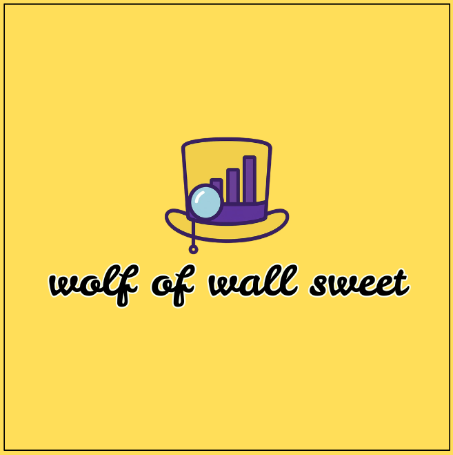

# Wolf of Wall Sweet 

**A Candy-Themed AI Agent Stock Market Simulation with Autonomous Trading Intelligence**

<p align="center">
  
</p>

**Built at Hacklytics 2026 by:**
- **Ibe Mohammed Ali** — Data/ML Engineer — Georgia State University
- **Ryan Varghese** — Backend Engineer — Georgia Tech
- **Poorav Rawat** — UX/UI & Web Dev — Georgia State University
- **Kashish Rikhi** — ML Engineer — Georgia State University

**Live:** [wolfofwallsweet.tech](https://wolfofwallsweet.tech)

---

## Overview

500 publicly traded companies rendered as candy-themed storefronts in a 3D city. 10,000+ autonomous AI agents — powered by a hierarchical Google Gemini multi-agent system — race between stores, physically collide at doorways, and compete for the most profitable trades in real time. Each store's size, color, and glow reflect its stock's performance, sector, and golden ticket status. A full Databricks medallion pipeline (Bronze → Silver → Gold) processes 602K rows of real stock data into trade-ready signals with zero lookahead bias, validated against the 2008 financial crash.

---

## Table of Contents

- [Features](#features)
- [Pages](#pages)
- [Tech Stack](#tech-stack)
- [System Architecture](#system-architecture)
- [How It Works](#how-it-works)
- [Databricks Medallion Pipeline](#databricks-medallion-pipeline)
- [Golden Ticket System](#golden-ticket-system)
- [AI Agent System](#ai-agent-system)
- [Crowd Simulation Engine](#crowd-simulation-engine)
- [Whale Arena](#whale-arena)
- [Live Trading Simulation](#live-trading-simulation)
- [2008 Financial Crash Validation](#2008-financial-crash-validation)
- [Frontend Payload Schema](#frontend-payload-schema)
- [Project Structure](#project-structure)
- [Getting Started](#getting-started)
- [Performance Optimizations](#performance-optimizations)
- [Documentation](#documentation)

---

## Features

- **3D Candy City** — Procedurally generated city of 500 candy storefronts using Poisson disk sampling and InstancedMesh rendering
- **10K+ AI Agents** — Autonomous Oompa Loompa crowd with spatial hashing, pathfinding, door-fighting physics, and trade lane assignment (BUY / SHORT / CALL / PUT)
- **Hierarchical Gemini AI** — 3-layer multi-agent system: 11 Sector Analysts → Portfolio Manager → Risk Desk
- **Live Trading Simulation** — Time slider drives day-by-day P&L accumulation with live-updating agent leaderboard
- **First-Person Mode** — WASD + mouse look via pointer lock to walk the streets at eye level
- **Golden Ticket System** — 5-tier signal detection (Dip, Shock, Asymmetry, Dislocation, Convexity) + Platinum (Wonka Bar) rarity tier
- **GNN Correlation Network** — Stock correlation graph rendered as interlocking candy cane pairs with helical red/white stripes
- **Shock Propagation Analysis** — Click any stock node to simulate contagion cascade through the correlation network with sector impact breakdown, depth analysis, and affected ticker rankings
- **4 Competing Whale Funds** — Wonka (Gemini AI), Slugworth (Momentum), Oompa (Value), Gobstopper (Contrarian)
- **Future Predictions** — Gemini-powered market predictions injected into the simulation
- **Time Travel** — Scrub through 5 years of historical data, present state, and predictive future modes
- **Minimap** — Real-time 180x180 grid overview of agent positions across the city
- **Market Regime Detection** — Hidden Markov Model identifies Bull/Bear/Neutral regimes from SPY data
- **FinBERT Sentiment** — HuggingFace FinBERT model scores financial news headlines for agent reactions
- **Live Databricks Connection** — 3-tier data loading: live Databricks queries → static JSON fallback → synthetic data, with real-time connection status badge
- **Delta Lake Time Travel** — Version-controlled data ensures zero retroactive contamination
- **WebSocket Streaming** — Real-time agent flow instructions and breaking news from FastAPI backend

---

## Pages

| Page | Description |
|------|-------------|
| **Golden City** | Main 3D simulation — 500 stores, 10K agents, leaderboard, time slider, whale arena |
| **Stock Network** | 3D force-directed graph of stock correlations with threshold slider and community detection |
| **Agent Network** | Agent relationship visualization — featured agents and whales as nodes, shared positions as edges |
| **Graph Playground** | Interactive GNN exploration — correlation threshold, regime toggle, shock propagation with cascade analysis, node detail panel (technicals, golden tickets, top correlations), sector/golden score color modes, ticker search, network stats |
| **Trade Journal** | Markdown-imported trade notes parsed into neural network graph with P&L tracking |
| **Agent Reactions** | Real-time dashboard — whale arena leaderboard, D3 treemap agent heatmap, store pressure grid, live decision stream with AI reasoning |

---

## Tech Stack

| Layer | Technology |
|-------|------------|
| **Frontend** | React 19 + TypeScript 5.9 + Vite 7 |
| **3D Engine** | Three.js 0.183 + @react-three/fiber 9 + @react-three/drei 10 |
| **State** | Zustand 5 |
| **Animation** | GSAP 3.14 + Framer Motion 12 |
| **Graphs** | D3 7.9 + react-force-graph-3d |
| **Routing** | React Router DOM 7 |
| **AI** | Google Gemini 2.0 Flash API (hierarchical multi-agent) |
| **Backend** | FastAPI + Uvicorn + WebSockets |
| **Data Pipeline** | Databricks (PySpark + Delta Lake) |
| **Sentiment** | HuggingFace FinBERT (model serving endpoint) |
| **Regime Detection** | Gaussian Hidden Markov Model (3-state) |
| **Dataset** | Kaggle Yahoo Finance 5Y (602K rows, 491 tickers, 11 GICS sectors) |
| **Deployment** | Vercel (frontend) + Docker (backend) |

---

## System Architecture

```
                                    ┌──────────────────────────────────┐
                                    │        Google Gemini API         │
                                    │  (11 Analysts + PM + Risk Desk)  │
                                    └───────────────┬──────────────────┘
                                                    │
┌─────────────┐    ┌────────────┐    ┌──────────────┴───────────────┐
│ Kaggle CSV  │───>│ Databricks │◄──>│       FastAPI Backend         │
│ (602K rows) │    │  Pipeline  │    │  /stocks (live query, 5m TTL) │
│             │    │  Bronze →  │    │  /analyze/news                │
│             │    │  Silver →  │    │  /market/regime               │
│             │    │  Gold →    │    │  /stocks/correlations         │
│             │    │  Export    │    │  /ws/agent-stream (WebSocket) │
└─────────────┘    └─────┬──────┘    └──────────────┬───────────────┘
                         │                          │
                         ▼                          ▼
               ┌─────────────────┐    ┌─────────────────────────────┐
               │ frontend_       │    │     React + Three.js App     │
               │ payload.json    │    │                               │
               │ (static         │    │  3-Tier Data Loading:         │
               │  fallback)      │    │  1. Live Databricks (via API) │
               └────────┬────────┘    │  2. Static JSON (fallback)    │
                        │             │  3. Synthetic (mock)           │
                        └────────────>│                               │
                                      │  ┌─────────┐  ┌───────────┐  │
                                      │  │CandyCity│  │Leaderboard│  │
                                      │  │ (3D)    │  │  (Live)   │  │
                                      │  └────┬────┘  └───────────┘  │
                                      │       │                       │
                                      │  ┌────┴──────────────────┐   │
                                      │  │  Crowd Simulation     │   │
                                      │  │  (10K agents,         │   │
                                      │  │   TypedArrays,        │   │
                                      │  │   spatial grid)       │   │
                                      │  └───────────────────────┘   │
                                      └──────────────────────────────┘
```

---

## How It Works

### Startup Flow

```
App.tsx init()
  ├── loadStockData() → 3-tier fallback:
  │   ├── Tier 1: apiClient.fetchStocks() → live Databricks query via backend
  │   ├── Tier 2: fetch /frontend_payload.json → static export fallback
  │   └── Tier 3: generateStockData() → 500 synthetic stocks
  ├── setStocks(stocks), setBaseStocks(baseStocks)
  ├── setCorrelationEdges(edges)
  ├── setDataSource('databricks' | 'static' | 'synthetic')
  ├── initTrackedAgents(stocks) → 24 agents with $0 P&L
  ├── setAgentLeaderboard(getLeaderboard())
  └── apiClient.startHealthCheck() → poll /health every 30s
      └── ConnectionStatusBadge updates: LIVE | API | STATIC | MOCK
```

### Per-Frame Update Loop

```
useFrame(delta)
  ├── Rebuild spatial grid from agent positions
  ├── For each of 10,000 agents:
  │   ├── Apply velocity damping (friction = 0.96)
  │   ├── State machine transition:
  │   │   ANALYZING → RUSHING → DOOR_FIGHTING → INSIDE → ANALYZING
  │   ├── If RUSHING: pathfind toward target store door
  │   ├── If DOOR_FIGHTING: attempt entry (1 agent per store per frame)
  │   └── If INSIDE: idle sway, tint to lane color, decrement timer
  ├── Count agents per store/lane for UI
  ├── Process WebSocket flow instructions
  └── Integrate: position += velocity × dt
```

### Time Slider Flow

```
TimeSlider.onChange(date)
  └── useStore.setCurrentDate(date)
      └── App.tsx useEffect:
          ├── modulateStocksByTime(baseStocks, date, mode)
          ├── setStocks(modulatedStocks)
          ├── processDay(date, stocks) → trade tracker daily P&L
          └── setAgentLeaderboard(getLeaderboard())
```

### Gemini AI Flow (every 15 seconds)

```
useCrowdSimulation useEffect
  ├── updateWhaleAllocations(stocks, timeMode, geminiEnabled)
  │   ├── Wonka Fund: runHierarchicalCycle(stocks)
  │   │   ├── 11× runSectorAnalyst(sector, stocks) [parallel]
  │   │   ├── runPortfolioManager(sectorReports) [sequential]
  │   │   └── runRiskDesk(allocations, stocks) [sequential]
  │   ├── Slugworth: momentumAllocations() [RSI > 55 + MACD > 0]
  │   ├── Oompa: valueAllocations() [drawdown < -8% + golden_score >= 1]
  │   └── Gobstopper: contrarianAllocations() [short RSI > 72, long RSI < 32]
  ├── applyWhaleToSimulation() → redirect 25% of agents per whale faction
  └── fetchAgentDecisions() → redirect featured agents to target tickers
```

### Store Selection Flow

```
Store.onClick → selectStock(stock) → StoreDetail overlay
  └── Shows 4 trade lanes (BUY / CALL / PUT / SHORT)
  └── Forward return distribution histogram
  └── Agent counts per lane
  └── Technical indicators (RSI, MACD, Bollinger, Z-score)
```

---

## Databricks Medallion Pipeline

A full Bronze → Silver → Gold pipeline processes raw stock data into trade-ready features:

```
Kaggle CSV (602K rows)
    │
    ▼
┌────────────────────────────────────────────────────────────────┐
│ BRONZE — Raw Data Ingestion                                    │
│                                                                │
│  bronze_ingestion.py      OHLCV + sector mapping → Delta Lake  │
│  bronze_news_ingestion.py  Financial news headlines             │
│  bronze_reddit_ingestion.py  r/wallstreetbets sentiment         │
│  bronze_macro_ingestion.py   SPY, VIX, interest rates, PMI     │
└────────────────────────────────┬───────────────────────────────┘
                                 │
                                 ▼
┌────────────────────────────────────────────────────────────────┐
│ SILVER — Feature Engineering (50+ indicators per stock/day)    │
│                                                                │
│  silver_features.py                                            │
│    SMA (20, 50, 200) · Bollinger Bands · RSI-14 · MACD        │
│    Realized volatility (20d, 60d) · Drawdown from ATH          │
│    Volume percentiles · Z-score · Momentum (5d, 20d)           │
│    Forward returns (5d, 20d, 60d) · Log returns                │
│                                                                │
│  silver_multimodal_features.py                                 │
│    FinBERT sentiment + macro regime + Reddit mentions           │
└────────────────────────────────┬───────────────────────────────┘
                                 │
                                 ▼
┌────────────────────────────────────────────────────────────────┐
│ GOLD — Signals, Scoring & ML Models                            │
│                                                                │
│  gold_tickets.py          Golden ticket scoring (5 tiers + Pt) │
│  gold_agent_archetypes.py 100 agent personalities (10×10)      │
│  gold_precompute_scenarios.py  Crash/rally/earnings scenarios  │
│  ml_regime_detection.py   3-state HMM (Bull/Bear/Neutral)      │
│  ml_correlation_graph.py  GNN + Louvain community detection    │
│  ml_finbert_sentiment.py  FinBERT sentiment scoring            │
│  ml_news_topics.py        LDA topic extraction                 │
└────────────────────────────────┬───────────────────────────────┘
                                 │
                                 ▼
┌────────────────────────────────────────────────────────────────┐
│ EXPORT + LIVE SERVING                                          │
│                                                                │
│  export_json.py → frontend_payload.json (500 stocks + edges)   │
│  cli_pipeline.py → CLI orchestrator for full pipeline          │
│  FastAPI /stocks → live query gold.golden_tickets (5-min cache)│
└────────────────────────────────────────────────────────────────┘
```

### Delta Lake Tables

| Catalog | Table | Description |
|---------|-------|-------------|
| `sweetreturns.bronze` | `raw_stock_data` | 602K rows OHLCV with sector mapping |
| `sweetreturns.bronze` | `macro_indicators` | SPY, VIX, rates, PMI |
| `sweetreturns.bronze` | `news_feed` | Financial news headlines |
| `sweetreturns.bronze` | `reddit_sentiment` | r/WSB posts + ticker mentions |
| `sweetreturns.silver` | `daily_features` | 50+ technical indicators per stock/day |
| `sweetreturns.silver` | `multimodal_features` | Sentiment + macro enriched features |
| `sweetreturns.gold` | `golden_tickets` | 5-tier ticket scoring + platinum |
| `sweetreturns.gold` | `market_regimes` | HMM-detected Bull/Bear/Neutral per date |
| `sweetreturns.gold` | `network_features` | GNN centrality, community detection |
| `sweetreturns.gold` | `agent_archetypes` | 100 agent personalities with trade parameters |
| `sweetreturns.gold` | `precomputed_scenarios` | Pre-built swarm allocations per scenario |
| `sweetreturns.gold` | `news_sentiment` | FinBERT scored sentiment per headline |
| `sweetreturns.gold` | `data_quality_reports` | Automated quality monitoring results |

### Pipeline CLI

```bash
python databricks/cli_pipeline.py --mode full       # Run everything
python databricks/cli_pipeline.py --mode silver-only # Feature engineering only
python databricks/cli_pipeline.py --mode gold-only   # Scoring + ML only
```

---

## Golden Ticket System

5 tiers of opportunity detection, each named after a candy. Stocks earn tickets based on technical conditions evaluated per day.

| Tier | Name | Condition | Signal |
|------|------|-----------|--------|
| 1 | **Sour Candy Drop** (Dip) | `drawdown < 15th percentile AND drawdown < -8%` | Deep dip from ATH, mean reversion play |
| 2 | **Jawbreaker** (Shock) | `(drawdown < -12% AND volume_pct > 80) OR vol_pct > 85` | Crash + volume spike or extreme volatility |
| 3 | **Fortune Cookie** (Asymmetry) | `fwd_60d_skew > 0.4 AND p5 < -5% AND p95 > 10%` | Positive skew — limited downside, outsized upside |
| 4 | **Taffy Pull** (Dislocation) | `zscore_20d < -1.5 AND SPY_underperformance > 5%` | Relative value vs SPY + mean reversion |
| 5 | **Golden Gummy Bear** (Convexity) | `any ticket above AND regime = Bull` | Opportunity in favorable market regime |
| P | **Wonka Bar** (Platinum) | `score >= 4 AND top 2% rarity AND skew >= 1.0` | Rarest tier — legendary opportunity |

**Golden Score** = count of tickets earned (0–5). Platinum stocks get score 5 + `is_platinum = true`.

Store dimensions scale with golden score: higher score = bigger, taller, more glowing storefront.

---

## AI Agent System

### Hierarchical Gemini Architecture (3 Layers)

```
Layer 1: 11 Sector Analysts (parallel, Gemini 2.0 Flash)
  └── Each analyzes sector's top stocks by golden_score, RSI, MACD, Bollinger, Z-score
  └── Recommends top 3 picks with action (BUY/CALL/PUT/SHORT) and conviction (1-100)

Layer 2: Portfolio Manager (sequential, Gemini Flash)
  └── Aggregates 11 sector reports → 6-10 position portfolio
  └── Enforces: 5-25% weight per position, sector diversification, long/short balance

Layer 3: Risk Desk (sequential, Gemini Flash)
  └── Validates portfolio → flags concentration, high-vol positions, dangerous shorts
  └── Approves or suggests adjustments → final allocations
```

**Reasoning Chain Output:** Each cycle produces a `ReasoningChain` with sector reports, portfolio allocations, risk review, final allocations, and timing metadata. Displayed in WhaleLeaderboard panel.

**Rate Limiting:** 10-second cycle interval. Falls back to algorithmic golden score picks if Gemini unavailable.

### 100 Agent Archetypes (10 Base Types × 10 Variants)

Defined in `gold_agent_archetypes.py`:

| Base Type | Strategy |
|-----------|----------|
| Institutional Value | Low turnover, deep value, large positions |
| Institutional Growth | Momentum chasing, growth at reasonable price |
| Hedge Fund Macro | Top-down, regime-aware, macro indicators |
| Hedge Fund Quant | Signal-driven, low emotion, high frequency |
| Retail Long-Term | Buy and hold, dividend focused |
| Retail Day Trader | High turnover, technical patterns |
| Retail Degenerate | YOLO options, meme stocks, r/WSB style |
| Robo-Advisor | Algorithmic, passive, rebalancing |
| News Junkie | Reactive to headlines, sentiment-driven |
| Contrarian | Fades the crowd, buys fear, sells greed |

Each archetype has: capital range, risk tolerance, greed, fear, news sensitivity, contrarian factor, preferred actions (BUY/CALL/PUT/SHORT weights), sector preference, holding period, visual traits (suit color, walk speed, aggression).

---

## Crowd Simulation Engine

### TypedArray-Based Physics (`useCrowdSimulation.ts`)

All 10,000+ agents stored as parallel TypedArrays for cache-coherent O(n) updates:

```typescript
SimulationData {
  positions:       Float32Array  // x, y, z per agent
  velocities:      Float32Array  // vx, vy, vz per agent
  targets:         Float32Array  // target door position
  states:          Uint8Array    // ANALYZING | RUSHING | DOOR_FIGHTING | INSIDE
  colors:          Float32Array  // r, g, b, a per agent
  genders:         Uint8Array    // 0=male, 1=female
  storeIndices:    Int16Array    // target store index
  stateTimers:     Float32Array  // time remaining in state
  urgencies:       Float32Array  // movement speed multiplier
  tradeLanes:      Uint8Array    // 0=BUY, 1=CALL, 2=PUT, 3=SHORT
  doorPositions:   Float32Array  // precomputed door x,z per store
  storeAgentCounts: Int16Array   // agents inside each store
  storeDoorCounts: Int16Array    // agents fighting at each door
  storeLaneCounts: Int16Array    // per-store per-lane counts
}
```

### Agent State Machine

```
ANALYZING (drifting, picking next target)
    │
    ▼
RUSHING (pathfinding to store door, speed based on urgency)
    │  distance < 2.5 units from door
    ▼
DOOR_FIGHTING (queued at entrance, 1 admitted per store per frame)
    │  admitted
    ▼
INSIDE (trading at lane quadrant, idle sway animation, tinted to lane color)
    │  timer expires
    ▼
ANALYZING (back to picking next target)
```

### Spatial Grid Collision Detection

4.0-unit cell size grid for O(n) neighbor queries. Each agent hashed to cell. Collision checks only against agents in adjacent cells. Prevents O(n²) blowup with 10K agents.

### Rendering (10 InstancedMeshes)

Agents rendered as Oompa Loompas using 10 InstancedMesh instances (one per body part: overalls, shirt, head, hair, legs, arms, shoes). 10 draw calls total instead of 100,000+. Per-frame matrix updates via `setMatrixAt()`.

---

## Whale Arena

4 competing hedge funds with different strategies. Each controls 25% of the agent population.

| Fund | Color | Strategy | Method |
|------|-------|----------|--------|
| **Wonka Fund** | Gold #FFD700 | Gemini AI | Hierarchical 11 analysts + PM + risk desk |
| **Slugworth Fund** | Orange #FF4500 | Momentum | Top 8 stocks with RSI > 55 + MACD > 0 |
| **Oompa Fund** | Green #00FF7F | Value/Dip | Top 8 deep drawdowns with golden_score >= 1 |
| **Gobstopper Fund** | Purple #9370DB | Contrarian | Short RSI > 72, long RSI < 32 |

WhaleLeaderboard panel shows P&L, trade count, current allocations, and Gemini reasoning chain for Wonka Fund.

---

## Live Trading Simulation

### Trade Tracker (`src/services/tradeTracker.ts`)

Tracks 24 agents (20 featured candy-named + 4 whale funds) with deterministic synthetic returns:

```typescript
// Deterministic per ticker+date — no randomness between sessions
function getSyntheticReturn(ticker: string, date: string): number {
  const seed = hashStr(ticker + date);
  const rand = seededRandom(seed);
  return (rand() - 0.4) * 0.08;  // range: -3% to +5% (slight bullish bias)
}
```

- **Position sizing:** $5K–$20K per trade
- **Options leverage:** 2.5× multiplier for CALL/PUT
- **Daily processing:** Each date advance picks a stock + action per agent, computes P&L
- **Leaderboard:** Sorted by cumulative profit, shows rank, trades, win rate, current position
- **LIVE indicator:** Pulsing green dot on leaderboard + red LIVE badge on time slider during playback

---

## 2008 Financial Crash Validation

Two validation notebooks prove zero lookahead bias across the entire pipeline:

### `validate_medallion.py` — Bronze → Silver Integrity

| Check | Result |
|-------|--------|
| Row count: Bronze 1,896,880 → Silver 1,896,259 (0.033% drop) | PASS |
| Ticker coverage: 1 missing (BAND) out of 621 | PASS |
| Core OHLCV columns: zero NULLs | PASS |
| GNN metadata: 12 sectors, 0 missing | PASS |
| Gold network_features → Silver referential integrity: 0 orphans | PASS |
| Feature completeness for GNN (daily_return, close): < 0.03% null | PASS |

### `validate_2008_crash.py` — Zero Lookahead Bias

| Check | Result |
|-------|--------|
| 2008 data coverage (424 tickers, 505 trading days) | PASS |
| `fwd_return_5d` — 0 mismatched, 0 leaked future prices | PASS |
| `fwd_return_20d` — 0 mismatched, 0 leaked future prices | PASS |
| SMA-20 backward-looking only: 0 mismatches in 49,072 crash rows | PASS |
| Drawdown uses only past peaks (deepest: -0.998) | PASS |
| Delta Lake Time Travel: v0 == current, 0 changed crash-era rows | PASS |
| Golden ticket drawdowns match silver layer exactly | PASS |
| Market regime: 69% Bear during Sep 2008 – Mar 2009 (84 Bear days) | PASS |

**Conclusion:** All signals (moving averages, drawdowns, volatility, golden tickets) are computed from data available at each point in time. Delta Lake Time Travel confirms zero retroactive contamination.

---

## Backend (FastAPI)

### Endpoints

| Method | Endpoint | Description |
|--------|----------|-------------|
| `GET` | `/health` | Health check + Databricks status + `stocks_available` flag |
| `GET` | `/stocks` | **Live stock payload** from Databricks gold layer (5-min cache), falls back to static JSON |
| `POST` | `/analyze/news` | Gemini + FinBERT sentiment analysis on news text/URL |
| `GET` | `/market/regime` | Current market regime from HMM (Bull/Bear/Neutral) |
| `GET` | `/stocks/correlations` | GNN correlation network edges |
| `GET` | `/stocks/archetypes` | 100 agent archetype definitions |
| `GET` | `/scenarios/precomputed` | Pre-built scenario flows |
| `WebSocket` | `/ws/agent-stream` | Bi-directional agent flow + breaking news streaming |

### Databricks Client (`databricks_client.py`)

- REST API (SQL Statement endpoint) — avoids connection hangs from SQL connector
- 35-second query timeout, auto-reconnect
- `get_stock_payload()` — queries `sweetreturns.gold.golden_tickets` for latest date snapshot, 5-minute cache TTL
- Caches regime, archetype, and network data
- Falls back to keyword heuristics if Databricks unavailable

### API Client (`src/services/apiClient.ts`)

Frontend singleton that manages the backend connection lifecycle:
- Auto-detects backend URL from `VITE_API_URL` or `http://{hostname}:8000`
- Polls `/health` every 30s to track connection status
- Status states: `connected` (Databricks live) → `fallback` (backend only) → `disconnected`
- `ConnectionStatusBadge` in navbar shows real-time status: **LIVE** (green) / **API** (gold) / **STATIC** (orange) / **MOCK** (red)

---

## Frontend Payload Schema

The `frontend_payload.json` exported from Databricks contains:

```json
{
  "stocks": [{
    "ticker": "AAPL",
    "company": "Apple Inc.",
    "sector": "Technology",
    "market_cap_rank": 1,
    "golden_score": 3,
    "ticket_levels": {
      "dip_ticket": true, "shock_ticket": false,
      "asymmetry_ticket": true, "dislocation_ticket": true,
      "convexity_ticket": false
    },
    "is_platinum": false,
    "rarity_percentile": 0.85,
    "direction_bias": { "buy": 0.5, "call": 0.2, "put": 0.1, "short": 0.2 },
    "forward_return_distribution": {
      "p5": -0.08, "p25": -0.02, "median": 0.01,
      "p75": 0.05, "p95": 0.12, "skew": 0.3
    },
    "drawdown_current": -0.15,
    "volume_percentile": 0.72,
    "volatility_percentile": 0.65,
    "brand_color": "#A2AAAD",
    "candy_type": "Pixel Candy Cube",
    "city_position": { "x": 12.5, "y": 0, "z": -8.3 },
    "store_dimensions": { "width": 2.1, "height": 2.8, "depth": 1.5 },
    "agent_density": 32,
    "speed_multiplier": 1.3,
    "technicals": {
      "rsi_14": 45, "macd_histogram": 0.08,
      "bb_pct_b": 0.55, "zscore_20d": -0.3,
      "realized_vol_20d": 0.18
    }
  }],
  "edges": [
    { "source": "AAPL", "target": "MSFT", "weight": 0.72 }
  ]
}
```

---

## Project Structure

```
wow-street/
├── src/
│   ├── components/                # 3D scene components
│   │   ├── CandyCity.tsx          # Main 3D scene — skybox, lighting, fog, camera
│   │   ├── Store.tsx              # Individual candy storefront (walls, door, trade lanes)
│   │   ├── StoreManager.tsx       # Store rendering, culling, and coordination
│   │   ├── StoreDetail.tsx        # Store interior overlay (4 lanes, histogram, technicals)
│   │   ├── CrowdSimulation.tsx    # 10K agent rendering (10 InstancedMeshes, Oompa Loompas)
│   │   ├── CandyCaneNetwork.tsx   # Correlation edges as candy cane pairs (Catmull-Rom splines)
│   │   ├── CandyParticles.tsx     # Particle effects for platinum stores
│   │   ├── GroundPlane.tsx        # Chocolate ground plane
│   │   ├── FirstPersonControls.tsx # WASD + mouse look via pointer lock
│   │   ├── TimeSlider.tsx         # Bottom-bar time slider (historical/present/future)
│   │   ├── AgentLeaderboard.tsx   # Top 24 agents with live P&L + LIVE indicator
│   │   ├── WhaleLeaderboard.tsx   # 4 whale fund allocations + Gemini reasoning chain
│   │   ├── SectorFilter.tsx       # 11-sector toggle filter
│   │   ├── Minimap.tsx            # 180x180 grid overview of agent positions
│   │   ├── FuturePredictions.tsx  # Gemini-powered market predictions panel
│   │   └── CandyIcons.tsx         # SVG icon library (lollipop, candy cane, etc.)
│   │
│   ├── pages/                     # Route views
│   │   ├── GoldenCityPage.tsx     # Main page — composes all 3D + UI components
│   │   ├── StockNetworkPage.tsx   # Force-directed correlation graph
│   │   ├── AgentNetworkPage.tsx   # Agent relationship visualization
│   │   ├── GraphPlaygroundPage.tsx # Interactive GNN exploration
│   │   ├── TradeJournalPage.tsx   # Trade history + neural graph
│   │   └── AgentReactionsPage.tsx # Real-time sentiment dashboard
│   │
│   ├── services/                  # AI & trading services
│   │   ├── apiClient.ts           # Backend API client — health checks, live stock fetching
│   │   ├── geminiService.ts       # 3-layer Gemini multi-agent (analysts → PM → risk)
│   │   ├── whaleArena.ts          # 4 whale fund strategies (Wonka/Slugworth/Oompa/Gobstopper)
│   │   ├── tradeTracker.ts        # Live P&L simulation for 24 agents
│   │   └── websocketClient.ts     # WebSocket client for agent flow streaming
│   │
│   ├── hooks/
│   │   └── useCrowdSimulation.ts  # Physics engine — TypedArrays, spatial grid, state machine
│   │
│   ├── store/
│   │   └── useStore.ts            # Zustand global state (stocks, time, agents, filters)
│   │
│   ├── data/
│   │   └── stockData.ts           # Stock generation, Poisson disk, pipeline loader, correlations
│   │
│   ├── types/
│   │   └── index.ts               # All TypeScript interfaces (Stock, Agent, Ticket, Graph, etc.)
│   │
│   └── App.tsx                    # Router + initialization + time modulation wiring
│
├── backend/
│   ├── app/
│   │   ├── main.py                # FastAPI server (REST + WebSocket endpoints)
│   │   └── databricks_client.py   # Databricks SQL REST API client with caching
│   ├── Dockerfile                 # Container config
│   └── requirements.txt           # fastapi, uvicorn, websockets, databricks-sql-connector
│
├── databricks/                    # Data pipeline (20 scripts)
│   ├── 00_setup_schema.py         # Initialize Delta Lake tables
│   ├── bronze_ingestion.py        # CSV → Delta Lake (OHLCV + sector mapping)
│   ├── bronze_news_ingestion.py   # Financial news headlines
│   ├── bronze_reddit_ingestion.py # r/wallstreetbets posts
│   ├── bronze_macro_ingestion.py  # SPY, VIX, rates, PMI
│   ├── silver_features.py         # 50+ technical indicators
│   ├── silver_multimodal_features.py # Sentiment + macro enrichment
│   ├── gold_tickets.py            # Golden ticket scoring (5 tiers + platinum)
│   ├── gold_agent_archetypes.py   # 100 agent personalities
│   ├── gold_precompute_scenarios.py # Market scenario flows
│   ├── ml_regime_detection.py     # 3-state Gaussian HMM
│   ├── ml_correlation_graph.py    # GNN + Louvain community detection
│   ├── ml_finbert_sentiment.py    # FinBERT sentiment scoring
│   ├── ml_news_topics.py          # LDA topic extraction
│   ├── export_json.py             # Build frontend_payload.json
│   ├── cli_pipeline.py            # CLI orchestrator
│   ├── run_local_pipeline.py      # Local testing (Pandas)
│   ├── validate_medallion.py      # Bronze → Silver integrity checks
│   ├── validate_2008_crash.py     # 2008 crash zero lookahead validation
│   ├── data_quality_monitor.py    # Continuous data quality monitoring
│   └── .env                       # Databricks credentials
│
├── assets/                        # Logo and icons
├── public/
│   └── frontend_payload.json      # Static payload for CDN serving
├── md/                            # Additional documentation
│   ├── QUICKSTART_CHECKLIST.md
│   ├── CLOUD_SETUP_GUIDE.md
│   ├── DATA_SCIENCE_GUIDE.md
│   └── IMPLEMENTATION_ROADMAP.md
├── plan.md                        # Full architecture spec (48KB)
├── DATABRICKS_TUTORIAL.md         # Databricks setup guide
├── CLAUDE.md                      # Claude Code project instructions
├── vercel.json                    # Vercel deployment config
├── package.json                   # Dependencies
├── tsconfig.json                  # TypeScript config
└── vite.config.ts                 # Vite build config
```

---

## Getting Started

### Prerequisites

- Node.js 18+
- npm or yarn

### Install & Run

```bash
# Install dependencies
npm install

# Start dev server
npm run dev

# Production build
npm run build

# Lint
npm run lint
```

### Environment Variables

**Frontend** (`.env`):
```
VITE_GEMINI_API_KEY=your-gemini-api-key
VITE_API_URL=http://localhost:8000
```

**Backend** (`backend/.env`):
```
DATABRICKS_HOST=https://your-workspace.cloud.databricks.com
DATABRICKS_TOKEN=your-token
DATABRICKS_SQL_WAREHOUSE_PATH=/sql/1.0/warehouses/your-warehouse-id
GEMINI_API_KEY=your-gemini-api-key
```

### Run Backend (for live Databricks data)

```bash
cd backend
pip install -r requirements.txt
uvicorn app.main:app --reload --port 8000
```

The frontend auto-detects the backend. With the backend running and Databricks credentials configured, the navbar badge shows **LIVE** (green). Without the backend, it falls back to static JSON or synthetic data automatically.

### Run Databricks Pipeline

See [DATABRICKS_TUTORIAL.md](DATABRICKS_TUTORIAL.md) for full setup. Run notebooks in order:

```
00_setup_schema.py → bronze_ingestion.py → silver_features.py →
gold_tickets.py → ml_*.py → gold_agent_archetypes.py → export_json.py
```

---

## Performance Optimizations

| Optimization | Why | Impact |
|--------------|-----|--------|
| TypedArray physics | Contiguous memory, cache-coherent | 10K agents at 30+ FPS |
| InstancedMesh rendering | 10 draw calls vs 100K+ | 60 FPS on mid-range GPU |
| Spatial grid hashing | O(n) collision detection | Eliminates O(n²) bottleneck |
| Zustand selectors | Components re-render only on subscribed slices | Minimal React overhead |
| Pre-computed door positions | Avoid per-frame recalculation | ~2ms saved per frame |
| Entry gating (1/store/frame) | Prevents pile-up, smoother animation | Consistent frame times |
| Shared geometry/materials | Reuse across 500 stores | Lower GPU memory |
| Deterministic PRNG | Reproducible placement without RNG overhead | Consistent layouts |
| Antialias disabled | `antialias: false` in Canvas | +15% GPU headroom |
| DPR capped at 1.5 | `dpr={[1, 1.5]}` | Prevents 4K overrender |

---

## Documentation

| File | Description |
|------|-------------|
| [plan.md](plan.md) | Full 48KB architecture specification |
| [DATABRICKS_TUTORIAL.md](DATABRICKS_TUTORIAL.md) | Databricks pipeline setup guide |
| [CLAUDE.md](CLAUDE.md) | Claude Code project instructions |
| [md/QUICKSTART_CHECKLIST.md](md/QUICKSTART_CHECKLIST.md) | Quick start checklist |
| [md/CLOUD_SETUP_GUIDE.md](md/CLOUD_SETUP_GUIDE.md) | Cloud deployment guide |
| [md/DATA_SCIENCE_GUIDE.md](md/DATA_SCIENCE_GUIDE.md) | Data science methodology |
| [md/IMPLEMENTATION_ROADMAP.md](md/IMPLEMENTATION_ROADMAP.md) | Implementation roadmap |
